# ☠️ Envenenamiento ARP — MITM con Ettercap

> **Asignatura:** Seguridad en las Comunicaciones  
> **Máster en Ciberseguridad**

---

## 📋 Índice

1. [Introducción](#1-introducción)
2. [Captura de credenciales en texto claro](#2-captura-de-credenciales-en-texto-claro)
3. [Modificar dirección IP mediante envenenamiento ARP](#3-modificar-dirección-ip-mediante-envenenamiento-arp)

---

## 1. Introducción

### Objetivos

El objetivo es entender los **ataques de red** y las debilidades que existen en las comunicaciones en redes internas, usando **Ettercap** en una red controlada:

1. Capturar credenciales en texto claro.
2. Modificar la dirección IP de la ruta por defecto en el sistema atacado.
3. Obtener capturas de pantalla del funcionamiento.

### Entorno de red

| Dispositivo | IP |
|---|---|
| Máquina atacante | `192.168.189.1` |
| Máquina víctima | `192.168.189.130 / .131` |
| Router (Gateway) | `192.168.189.2` |

---

## 2. Captura de credenciales en texto claro

**Ettercap** permite realizar ataques que se aprovechan de vulnerabilidades en el protocolo ARP. Se combina con un ataque **MITM (Man-in-the-Middle)** para interceptar tráfico HTTP no cifrado y capturar credenciales.

Se escanean los hosts de la red desde Ettercap:

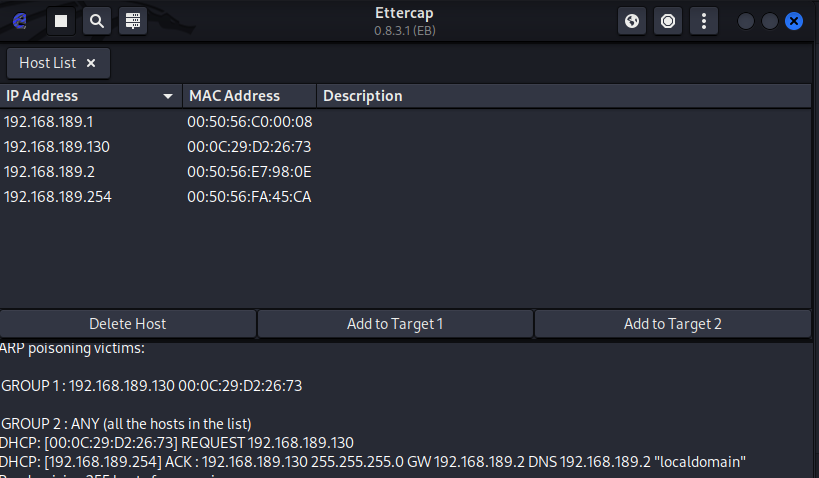

La máquina atacante (`192.168.189.1`) escucha el tráfico de la víctima (`192.168.189.130`). Se simula un login en una página web que usa **HTTP** (sin cifrado).

Se captura el tráfico simultáneamente con Wireshark:

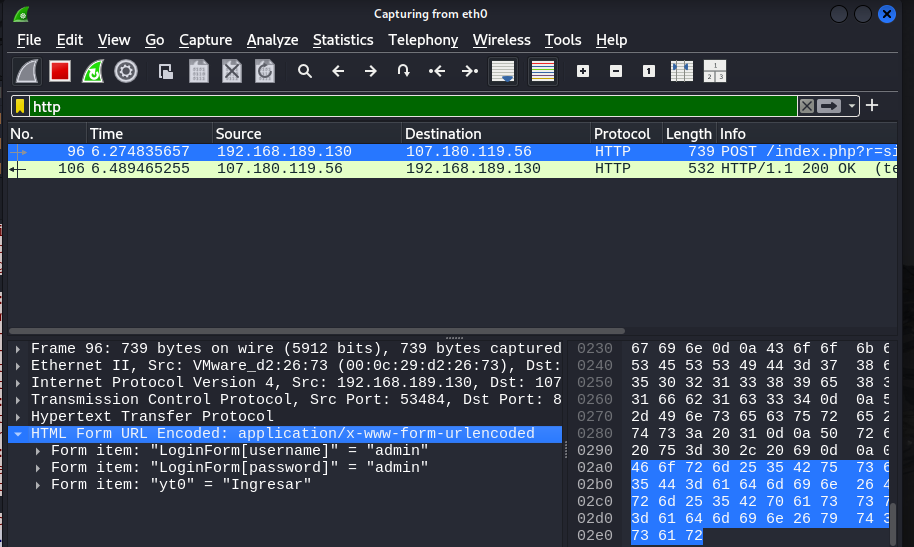

Las credenciales aparecen en texto claro en la captura:

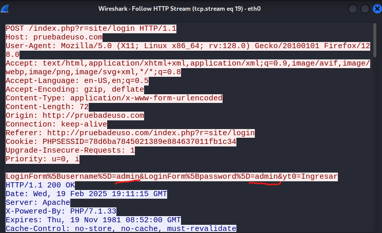

✅ **Credenciales capturadas** — el tráfico HTTP sin cifrar expone directamente usuario y contraseña al atacante MITM.

---

## 3. Modificar dirección IP mediante envenenamiento ARP

### Concepto

El **envenenamiento ARP (ARP Spoofing)** permite al atacante engañar a la víctima haciéndole creer que el **gateway legítimo es el equipo atacante**. Esto se consigue enviando respuestas ARP falsas que asocian la MAC del atacante con la IP del router:

```
Situación normal:
  Víctima ──► Router (192.168.189.2 = MAC_ROUTER)

Tras envenenamiento ARP:
  Víctima ──► Atacante (192.168.189.2 = MAC_ATACANTE) ──► Router
```

El tráfico de la víctima pasa por el equipo atacante antes de llegar a Internet.

### Ejecución del ataque

Se listan los hosts descubiertos en la red:

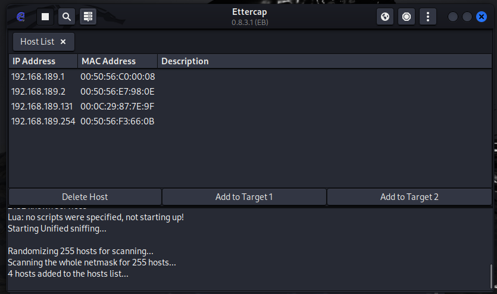

Se comprueba el gateway por defecto en el equipo víctima antes del ataque:

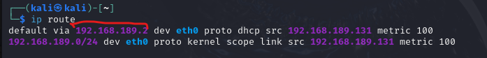

Se seleccionan **víctima** y **router** como targets del envenenamiento en Ettercap:


Se lanza el ataque **MITM ARP**:

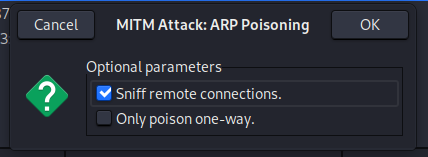

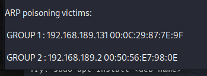

### Mensajes ARP capturados durante el ataque

#### 1. ARP Reply falso — Atacante suplanta al router

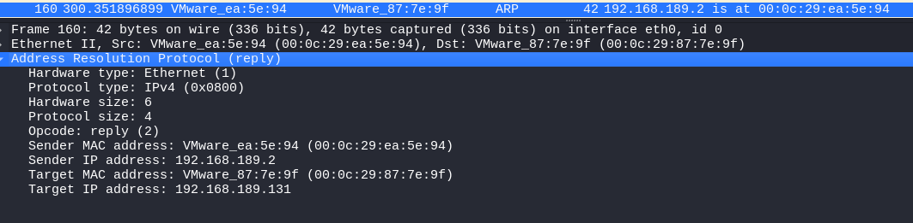

> El atacante envía una ARP Reply falsa asociando la IP del router (`192.168.189.2`) a su propia MAC (`00:0C:29:EA:5E:94`). La víctima actualiza su caché y redirige su tráfico al atacante en lugar del router legítimo.

#### 2. ARP Reply con detección de IP duplicada

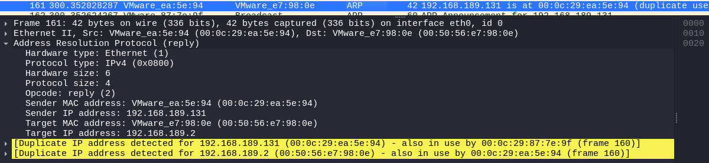

> El atacante también suplanta a la víctima ante el router. Wireshark detecta un **conflicto de IPs**: `192.168.189.131` está siendo usada por dos MACs simultáneamente — la legítima (`00:0C:29:87:7E:9F`) y la del atacante.

#### 3. ARP Announcement — Reacción de la víctima

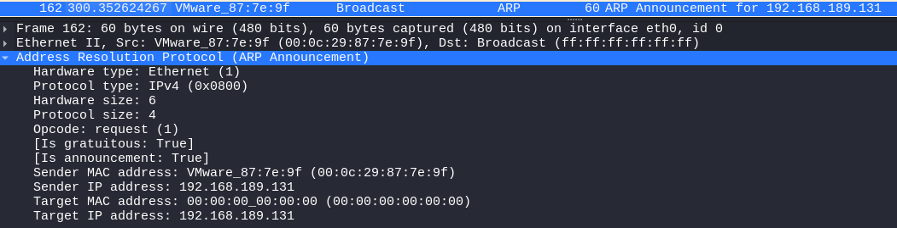

> La víctima detecta la suplantación y **anuncia su propia IP y MAC legítima** a toda la red para intentar corregirlo. Es un mecanismo de defensa automático del sistema operativo.

#### 4. ARP Reply legítimo del router

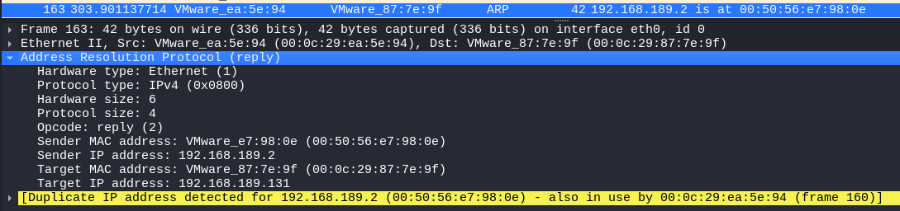

> El router intenta mantener la relación correcta entre su IP (`192.168.189.2`) y su MAC (`00:50:56:e7:98:0e`). Sin embargo, el atacante sigue enviando falsas ARP Replies a mayor frecuencia, manteniendo el envenenamiento activo.

### Comparativa de la caché ARP

**ANTES del envenenamiento — caché legítima:**

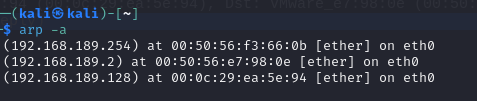

**DURANTE el envenenamiento — caché envenenada:**

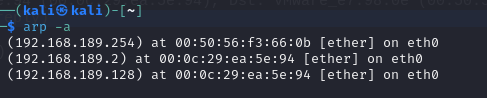

> La víctima ha actualizado la entrada del router (`192.168.189.2`) en su caché ARP **sustituyendo la MAC legítima del router por la MAC del atacante**. Todo el tráfico destinado al gateway pasará ahora por el equipo atacante.

✅ **Envenenamiento ARP completado.** El tráfico de la víctima es redirigido al atacante antes de llegar al router legítimo, completando el ataque MITM.
