# 🍯 Honeypots — T-Pot con Cowrie

> **Asignatura:** Seguridad en las Comunicaciones — Módulo 6  
> **Máster en Ciberseguridad**

---

## 📋 Índice

1. [Introducción](#1-introducción)
   - 1.1 [Objetivos](#11-objetivos)
2. [Detalle de la configuración](#2-detalle-de-la-configuración)
   - 2.1 [Archivos de configuración](#21-archivos-de-configuración)
   - 2.2 [Revisión de contenedores](#22-revisión-de-contenedores)
   - 2.3 [Revisión de logs con Kibana](#23-revisión-de-logs-con-kibana)
3. [Simulación de intrusión](#3-simulación-de-intrusión)
4. [Pruebas](#4-pruebas)
5. [Funcionamiento](#5-funcionamiento)

---

## 1. Introducción

### 1.1 Objetivos

El objetivo de esta actividad es entender los **ataques de red** y las debilidades que existen en las comunicaciones en redes internas, mediante la configuración de un honeypot y la simulación de intrusiones.

Tareas realizadas:
- Revisión detallada de la configuración.
- Acceso simulando ser un intruso.
- Realización de distintas pruebas para comprender el funcionamiento.
- Captura de pantalla del funcionamiento de la herramienta.

---

## 2. Detalle de la configuración

La herramienta utilizada es **T-Pot**, instalada sobre un servidor Ubuntu.

**T-Pot** es una plataforma que reúne múltiples honeypots sobre un servidor Ubuntu. Para gestionar y aislar los honeypots, T-Pot utiliza **contenedores Docker**, lo que permite ejecutar varios servicios en paralelo como **Cowrie**, **Conpot**, **Dionaea**, etc.

### 2.1 Archivos de configuración

T-Pot utiliza Docker para administrar todos sus servicios. Cada honeypot corre dentro de su propio contenedor, simplificando su configuración y ejecución.

El primer paso para revisar la configuración es listar los contenedores en ejecución:

```bash
docker ps
```

Este comando muestra un listado detallado con los nombres de los servicios, puertos asignados y su estado.

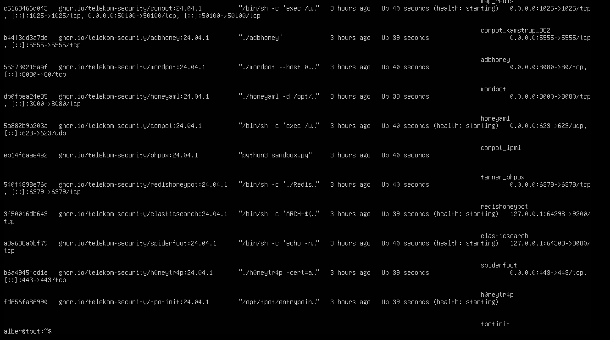

Aunque T-Pot no instala archivos de configuración directamente en el sistema, se puede inspeccionar la configuración de los contenedores revisando el archivo `docker-compose.yml`. Este archivo define cómo se despliegan los servicios, incluyendo:
- El puerto en el que escucha cada servicio.
- La red interna que utiliza.
- Los volúmenes de datos persistentes.

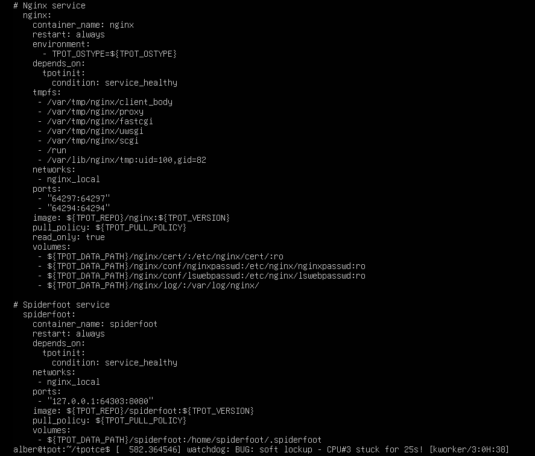

### 2.2 Revisión de contenedores

Para examinar el comportamiento de un servicio específico (por ejemplo, **Cowrie**), se pueden consultar sus logs para confirmar que el honeypot está capturando intentos de conexión:

```bash
docker logs cowrie
```

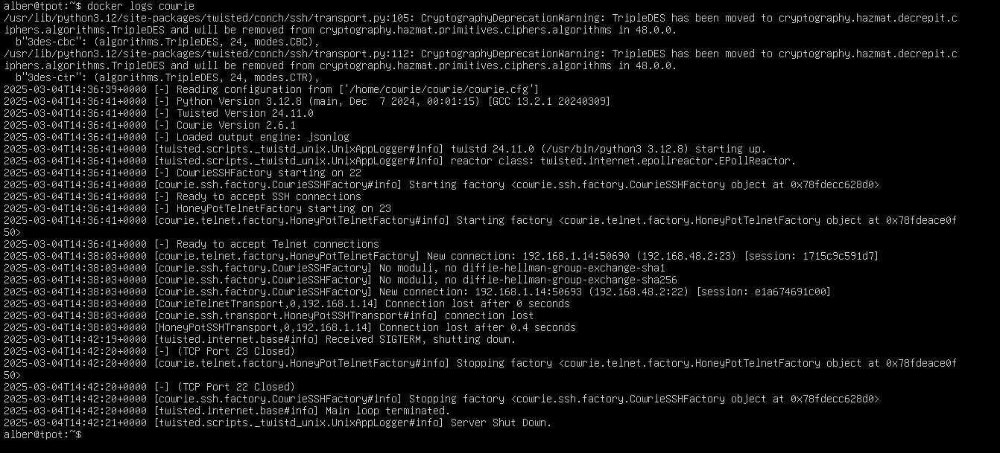

### 2.3 Revisión de logs con Kibana

T-Pot ofrece una interfaz gráfica a través de **Kibana** donde se pueden revisar todos los logs generados por los honeypots. Kibana permite visualizar de forma gráfica los eventos de seguridad, incluyendo:
- Intentos de ataque.
- Conexiones fallidas.
- Credenciales utilizadas en los intentos de acceso.

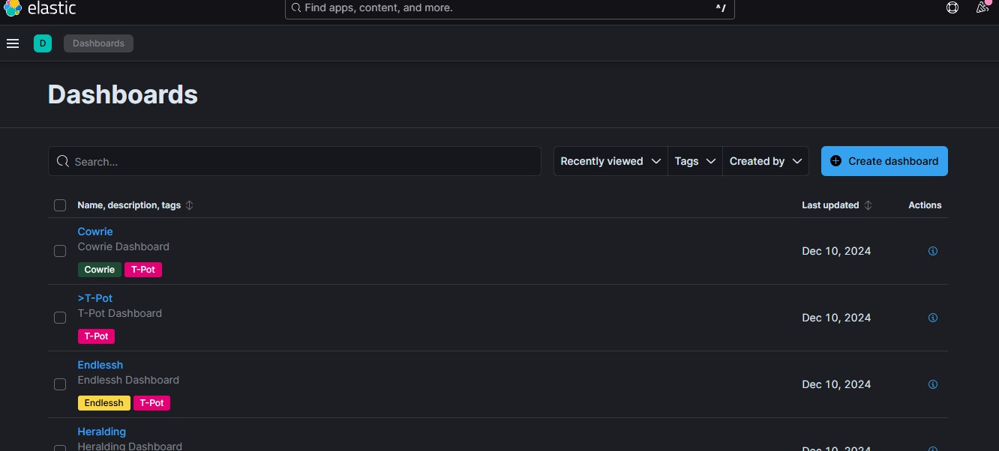

---

## 3. Simulación de intrusión

Para realizar la simulación de intrusión se configura una máquina **Kali Linux** como atacante, desde la cual se identifican puertos y servicios abiertos en el honeypot:

```bash
nmap -sS -p- 192.168.1.12
```

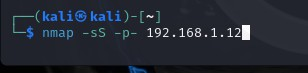

El escaneo revela que el honeypot **Cowrie** simula un servicio SSH en el **puerto 22**. Se procede a simular un ataque de fuerza bruta con credenciales erróneas y finalmente se introduce el par válido para generar eventos de log.

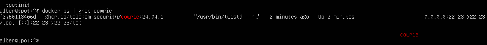

**Intrusión SSH simulada:**

```bash
ssh alber@192.168.1.21 -p 22
```

Se realizan dos intentos fallidos (simulación de fuerza bruta) y finalmente se accede con las credenciales correctas:

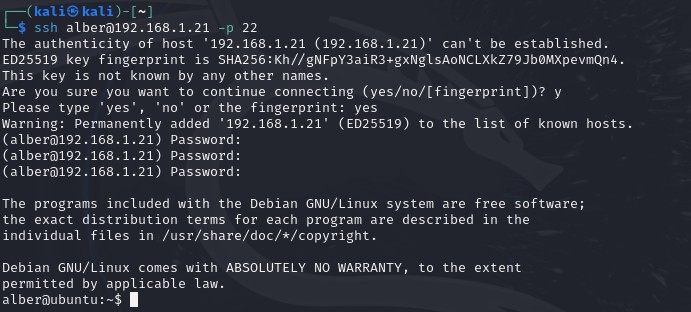

✅ Intrusión conseguida. El sistema es en realidad el honeypot Cowrie registrando toda la actividad.

**Verificación en Kibana:**

Toda la actividad queda registrada y es visible en tiempo real a través del dashboard de Cowrie en Kibana:

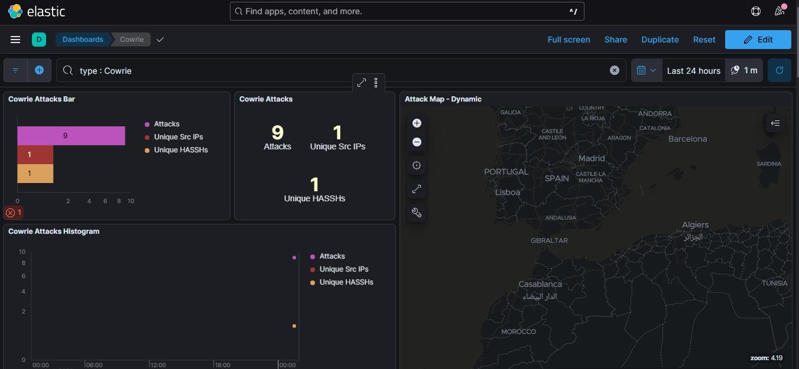

Kibana muestra el resumen de los intentos de ataque, incluyendo el **usuario** y **contraseña** utilizados en cada intento de login:

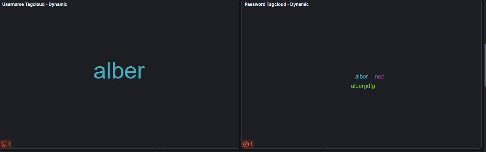

> Kibana permite filtrar por tipo de ataque, tiempo o servicio, facilitando el análisis de lo ocurrido durante la simulación y ofreciendo información útil para la detección de ataques reales.

---

## 4. Pruebas

Continuando con la simulación, se prueban diferentes comandos a través del acceso SSH en Cowrie para ver cómo el honeypot los registra. El objetivo es verificar la **correlación entre las acciones del atacante y los registros generados en T-Pot**.

Para ampliar la simulación, se utiliza la emulación de **Telnet** que ofrece Cowrie a través del **puerto 23**:

```bash
telnet 192.168.1.21 23
```

Se realizan varios intentos de login con credenciales incorrectas y finalmente se introduce un par válido:

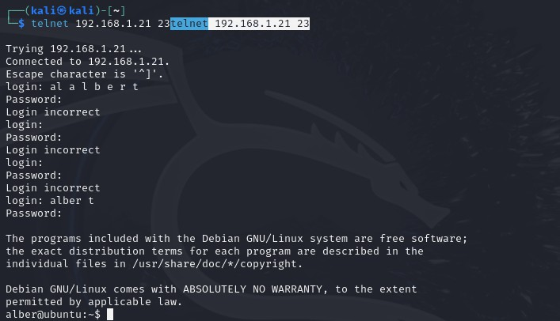

✅ Conexión Telnet establecida. Todos los eventos quedan registrados en los logs de Cowrie.

**Logs en Kibana tras la intrusión Telnet:**

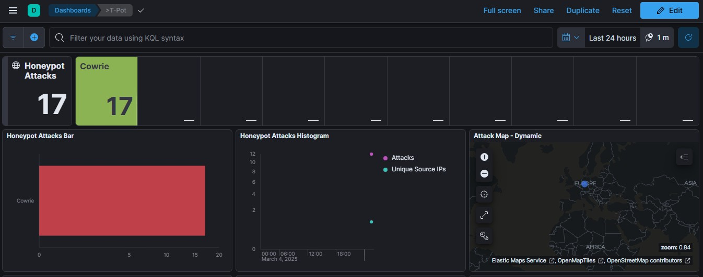

Se verifica que los intentos de login tienen relación con las credenciales que aparecen en el log:

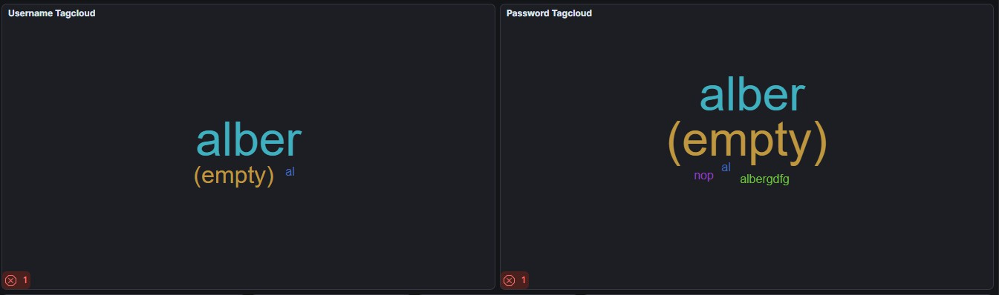

**Datos avanzados en Kibana:**

Kibana también muestra detalles más exhaustivos del servicio: alertas de tráfico detectadas y clasificadas, e IPs que son principales fuentes de alertas, lo que permite al analista de seguridad determinar si representan un riesgo real o incidencias menores:

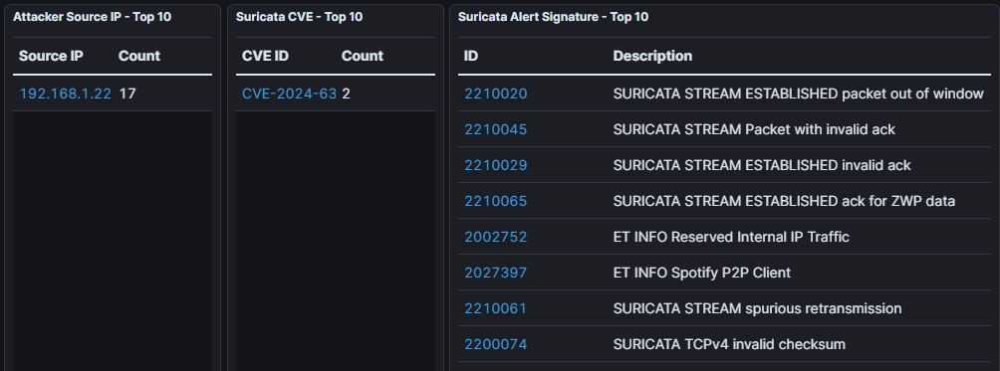

**Prueba de comandos sobre la conexión Telnet:**

Una vez establecida la sesión, se ejecutan comandos para simular acciones de intrusión:

```bash
ls
id
sudo -l
```

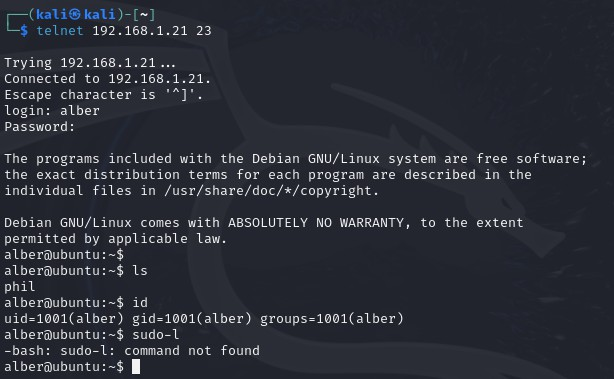

**Registros del atacante en Cowrie:**

El honeypot registra toda la actividad del intruso: IP del atacante, número de ataques y listado completo de comandos ejecutados durante la intrusión:

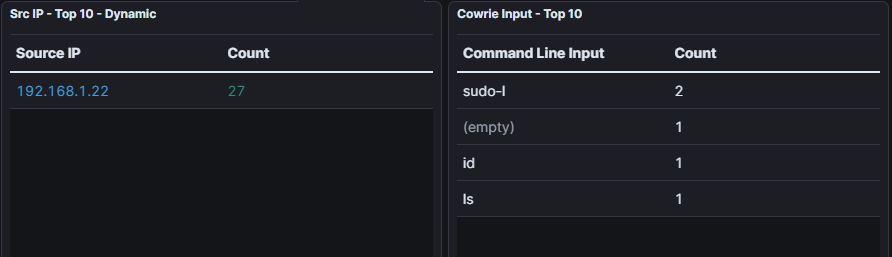

| Src IP | Ataques |
|--------|---------|
| 192.168.1.22 | 27 |

| Comando ejecutado | Veces |
|---|:---:|
| `sudo -l` | 2 |
| `id` | 1 |
| `ls` | 1 |

---

## 5. Funcionamiento

Se verifica el funcionamiento general de T-Pot accediendo a su interfaz gráfica centralizada:

```
https://192.168.1.12:64297/
```

Desde aquí se puede ver de forma centralizada todos los detalles del tráfico, gráficos de ataques y acceso a las distintas herramientas integradas:

| Herramienta | Función |
|---|---|
| **Attack Map** | Mapa en tiempo real de ataques detectados |
| **Cyberchef** | Análisis y decodificación de datos |
| **Elasticvue** | Gestión visual de Elasticsearch |
| **Kibana** | Dashboards y análisis de logs |
| **Spiderfoot** | OSINT e inteligencia de amenazas |
| **SecurityMeter** | Métricas de seguridad globales |
| **T-Pot ReadMe** | Documentación de la plataforma |

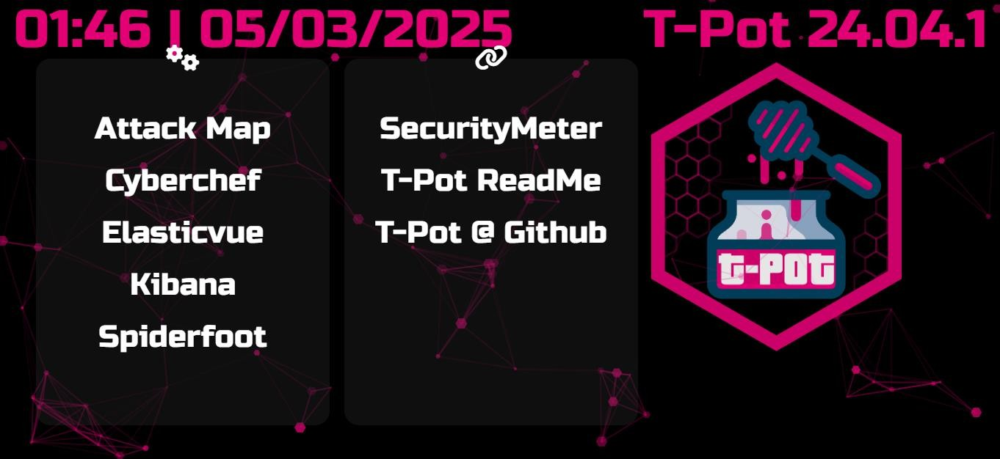
