# 📶 WPA/WPA2 — Análisis de paquetes, Handshake y Ataques de diccionario

> **Asignatura:** Seguridad en las Comunicaciones  
> **Máster en Ciberseguridad**

---

## 📋 Índice

1. [Introducción](#1-introducción)
2. [Tipos de paquetes del protocolo WPA](#2-tipos-de-paquetes-del-protocolo-wpa)
   - 2.1 [Beacon Frame](#21-paquetes-beacon-frame)
   - 2.2 [Probe Request / Probe Response](#22-paquetes-probe-requestprobe-response)
   - 2.3 [Authentication](#23-paquetes-authentication)
   - 2.4 [Association Request / Association Response](#24-paquetes-association-requestassociation-response)
3. [Handshake — 4-Way Handshake EAPOL](#3-handshake--4-way-handshake-eapol)
   - 3.1 [Mensaje 1](#31-mensaje-1)
   - 3.2 [Mensaje 2](#32-mensaje-2)
   - 3.3 [Mensaje 3](#33-mensaje-3)
   - 3.4 [Mensaje 4](#34-mensaje-4)
   - 3.5 [Contenido del handshake](#35-contenido-del-handshake)
4. [Ruptura del handshake](#4-ruptura-del-handshake)
   - 4.1 [Aircrack-ng](#41-aircrack-ng)
   - 4.2 [Hashcat](#42-hashcat)
5. [Descifrado con Wireshark](#5-descifrado-con-wireshark)

---

## 1. Introducción

### Objetivos

A partir de una captura de tráfico de una red WiFi con autenticación **WPA2**, se responden las siguientes cuestiones:

1. Identificar todos los tipos de paquetes del protocolo WPA con sus campos más significativos.
2. Extraer el handshake de la captura y comentar su contenido.
3. Romper el handshake usando un diccionario con **al menos dos herramientas** diferentes.
4. A partir de la clave obtenida, **descifrar toda la información de la captura** y visualizarla en Wireshark.

---

## 2. Tipos de paquetes del protocolo WPA

En la captura se observan los siguientes tipos de paquetes involucrados en el proceso de conexión WPA2:

| Tipo de paquete | Función |
|---|---|
| **Beacon Frame** | El AP anuncia su presencia periódicamente |
| **Probe Request / Response** | El cliente busca redes y el AP responde |
| **Authentication** | Autenticación inicial entre cliente y AP |
| **Association Request / Response** | El cliente solicita asociarse al AP |
| **4-Way Handshake (EAPOL)** | Negociación de claves de cifrado |

Para el análisis se aplica el siguiente filtro en Wireshark para eliminar el ruido y centrarse en el tráfico relevante:

```
eapol || wlan.fc.type_subtype == 0x08 || wlan.fc.type_subtype == 0x05 || 
wlan.fc.type_subtype == 0x04 || wlan.fc.type_subtype == 0x0b || 
wlan.fc.type_subtype == 0x00 || wlan.fc.type_subtype == 0x01
```


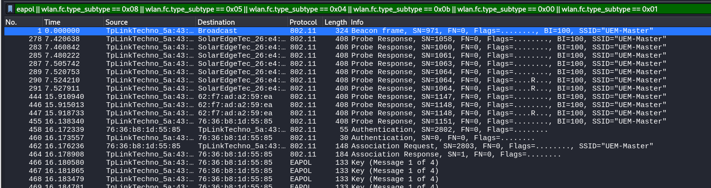

---

### 2.1 Paquetes Beacon Frame

Enviado periódicamente por el **punto de acceso (AP)** para anunciar su presencia a los clientes cercanos.

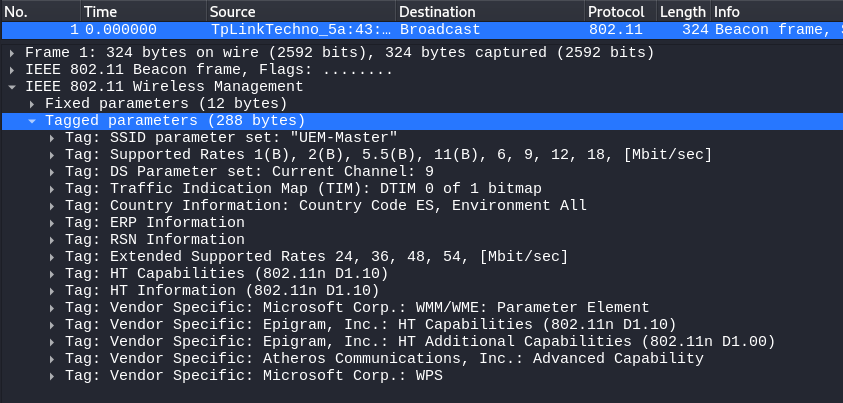

**Campos relevantes:**

| Campo | Descripción |
|---|---|
| **SSID** | Nombre de la red WiFi |
| **BSSID** | MAC del AP |
| **RSN Information Element** | Indica uso de WPA2, tipo de cifrado y métodos de autenticación |

**Importancia:** Permite a los clientes identificar redes disponibles y conocer su configuración de seguridad antes de intentar conectarse.

---

### 2.2 Paquetes Probe Request/Probe Response

- **Probe Request:** Enviado por el cliente para buscar redes disponibles. Puede ser general (broadcast) o dirigido a un SSID concreto.
- **Probe Response:** Respuesta del AP al Probe Request con toda la información necesaria para que el cliente decida si conectarse.

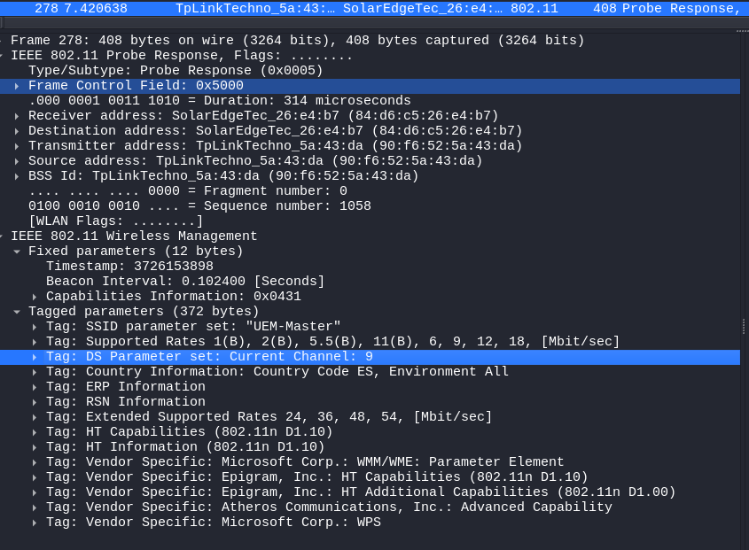

**Campos relevantes:**

| Campo | Descripción |
|---|---|
| **SSID** | En blanco en Probe Request si busca cualquier red |
| **Supported Rates & Capabilities** | Información sobre velocidad y seguridad de la red |
| **RSN Information** | Confirma que la red está protegida por WPA2 |

**Importancia:** Inicia el contacto entre cliente y AP. Permite conocer si la red es segura y compatible antes de proceder a la autenticación.

---

### 2.3 Paquetes Authentication

Establece la autenticación inicial entre el cliente y el AP. En WPA2 se usa **Open System Authentication** (no autentica realmente la identidad).

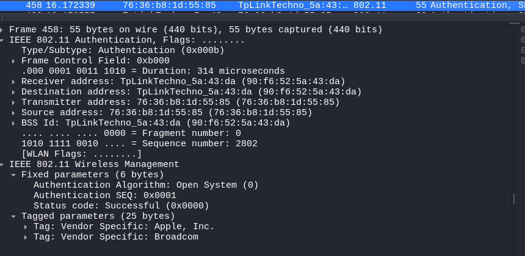

**Campos relevantes:**

| Campo | Descripción |
|---|---|
| **Authentication Algorithm** | 0 = Open System |
| **Sequence Number** | Indica el orden del mensaje (1 o 2) |
| **Status Code** | Informa si la autenticación fue exitosa (0 = éxito) |

**Importancia:** Aunque no autentica realmente la identidad del cliente, es un paso obligatorio antes de la asociación. Solo inicia el proceso de conexión.

---

### 2.4 Paquetes Association Request/Association Response

- **Association Request:** El cliente solicita asociarse con un AP específico.
- **Association Response:** El AP responde aceptando o rechazando la asociación.

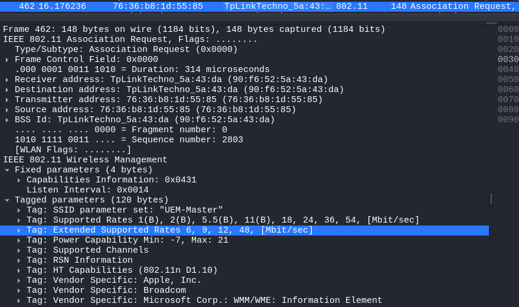

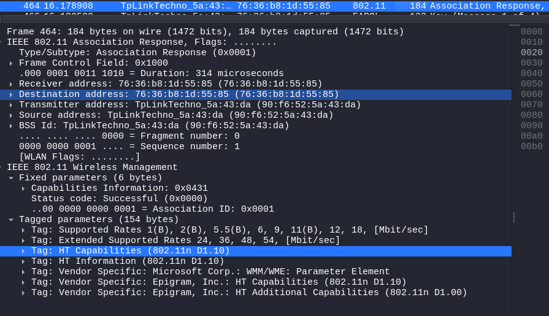

**Campos relevantes:**

| Campo | Descripción |
|---|---|
| **SSID** | Identificador de la red |
| **Supported Rates / Capabilities** | Información técnica del cliente/AP |
| **RSN Information** | Confirma uso de WPA2 y define el cifrado |
| **Status Code** | 0 = éxito, otro valor = error |
| **Association ID** | Identificador único asignado al cliente |

**Importancia:** Marca el inicio real de la conexión. Si la asociación es aceptada, cliente y AP están listos para negociar las claves en el **4-Way Handshake**.

---

## 3. Handshake — 4-Way Handshake EAPOL

El **4-Way Handshake** es el proceso mediante el cual el cliente y el AP negocian las claves para cifrar la comunicación. Consta de cuatro mensajes EAPOL.

```
AP ──── Msg 1 (ANonce) ────────────────────────────► Cliente
AP ◄─── Msg 2 (SNonce + MIC) ────────────────────── Cliente
AP ──── Msg 3 (GTK cifrada + MIC) ───────────────► Cliente
AP ◄─── Msg 4 (Confirmación) ────────────────────── Cliente
```

### 3.1 Mensaje 1

El AP envía el **ANonce** (número aleatorio) al cliente. Es el primer paso para que ambos puedan generar la **PTK (Pairwise Transient Key)**.

| Campo | Valor |
|---|---|
| Tipo de trama | QoS Data (encapsula EAPOL) |
| Transmisor/AP | `90:f6:52:5a:43:da` |
| Receptor/STA | `76:36:b8:1d:55:85` |
| Protocolo | EAPOL Key (802.1X-2004) |
| Key Descriptor Type | 2 (RSN Key — WPA2) |
| Key ACK | ✅ Activado (espera respuesta) |
| Key MIC | ❌ No presente (aún no hay verificación) |
| ANonce | Valor único generado por el AP |
| Replay Counter | 2 (protección contra ataques de repetición) |

### 3.2 Mensaje 2

El cliente responde con su propio **SNonce** y un **MIC** que demuestra conocimiento de la clave precompartida (PSK) sin revelarla.

| Campo | Valor |
|---|---|
| Tipo de trama | QoS Data |
| Origen (STA) | `76:36:b8:1d:55:85` |
| Destino (AP) | `TpLinkTechno_5a:43:da` |
| SNonce | Generado por el cliente |
| MIC | ✅ Presente (verifica conocimiento de la PSK) |
| Replay Counter | Coherente con el mensaje anterior |

### 3.3 Mensaje 3

El AP valida el MIC del cliente, genera e instala la PTK, y envía la **GTK (Group Temporal Key)** cifrada al cliente para el tráfico multicast/broadcast.

| Campo | Valor |
|---|---|
| Longitud | 175 bytes |
| Key Descriptor Type | RSN Key (2) |
| Install | ✅ Activado — la PTK se instala |
| Key ACK | ✅ Activado |
| Key MIC | ✅ Activado — verificado por el AP |
| Encrypted Key Data | ✅ Presente — contiene la GTK cifrada |
| WPA Key Nonce | Igual al ANonce del mensaje 1 |
| Key Length | 16 bytes |
| Replay Counter | 3 |

### 3.4 Mensaje 4

El cliente confirma al AP que ha recibido y descifrado correctamente la GTK. **El handshake queda completado** y puede comenzar el intercambio de datos cifrados.

| Campo | Valor |
|---|---|
| Longitud | 95 bytes |
| Key Descriptor Type | RSN Key (2) |
| Install | ❌ No activado (ya se realizó en el mensaje 3) |
| MIC | ✅ Activado (confirma integridad) |
| Encrypted Key Data | ❌ No presente |
| WPA Key Nonce | En ceros (habitual en este mensaje final) |
| Replay Counter | 3 |

### 3.5 Contenido del handshake

Se analiza el contenido del handshake usando aircrack como herramienta de lectura:

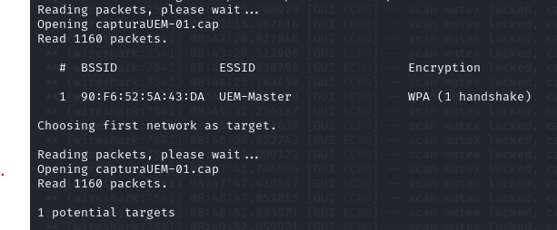

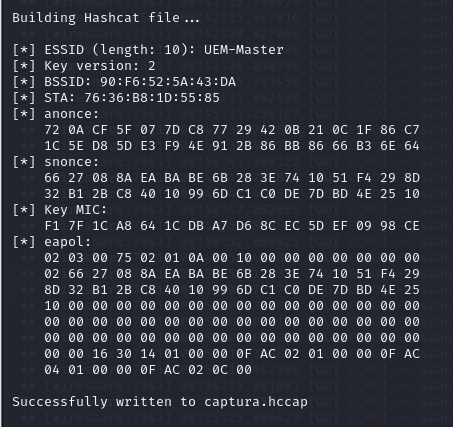

---

## 4. Ruptura del handshake

Se realiza un **ataque de diccionario** al handshake capturado para comprobar la robustez de la clave. Se usan dos herramientas diferentes.

### 4.1 Aircrack-ng

Se usa `aircrack-ng` con el diccionario `rockyou.txt` disponible en Kali Linux:

```bash
aircrack-ng capturaUEM-01.cap -w /usr/share/wordlists/rockyou.txt
```

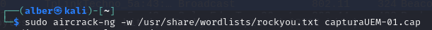

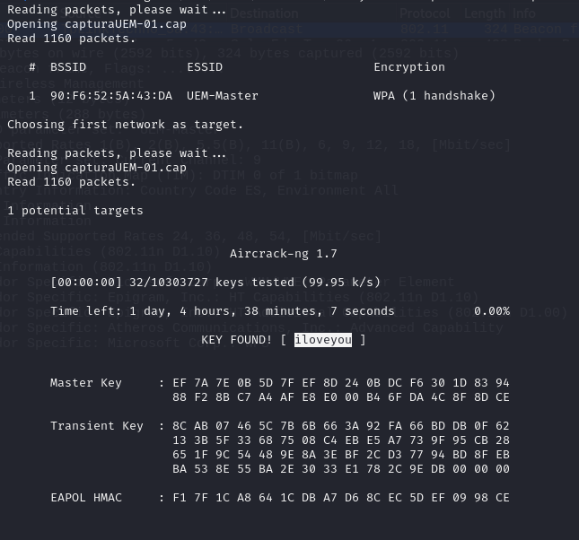

✅ **Contraseña obtenida: `iloveyou`**

---

### 4.2 Hashcat

Se convierte la captura al formato requerido por Hashcat:

```bash
hcxpcapngtool capturaUEM-01.cap -o capturaUEM-01.22000
```

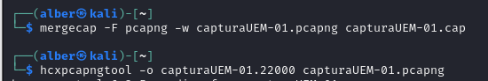

Se verifica el formato generado:

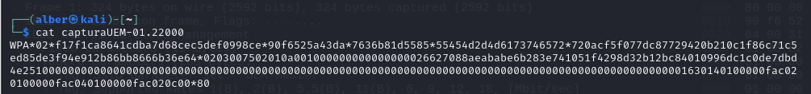

Se ejecuta Hashcat con ataque de diccionario (`-a 0`) sobre hashes WPA/WPA2 (`-m 22000`):

```bash
hashcat -a 0 -m 22000 capturaUEM-01.22000 /usr/share/wordlists/rockyou.txt --force
```

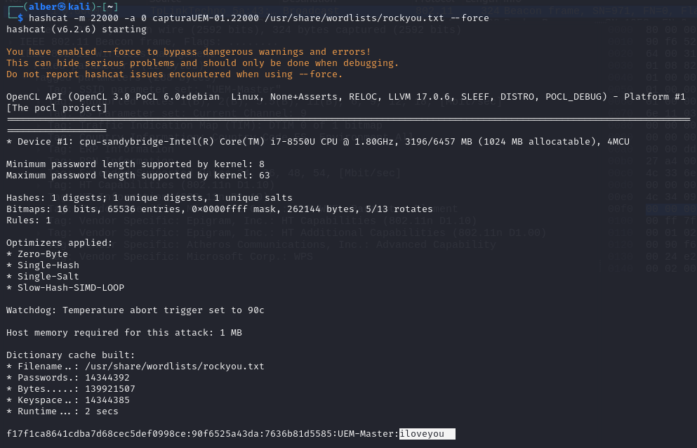

✅ **Contraseña confirmada con Hashcat: `iloveyou`**

---

## 5. Descifrado con Wireshark

Con la contraseña obtenida se descifra **toda la sesión capturada** directamente en Wireshark.

Se añade la clave en `Edit → Preferences → Protocols → IEEE 802.11`:

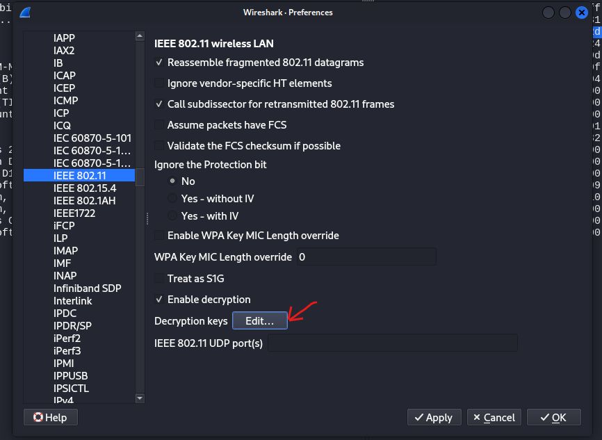

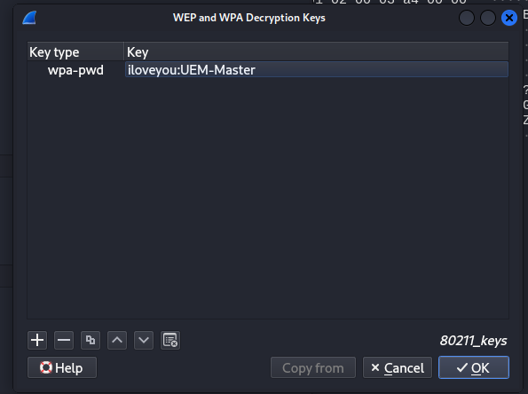

Se filtra por `ip` para verificar que los paquetes han sido descifrados correctamente. Si aparecen resultados con información de red IP, significa que el descifrado fue exitoso:

```
ip
```

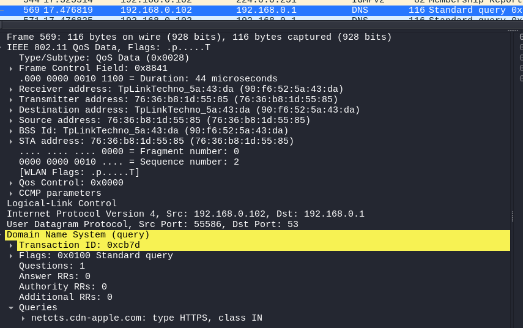

✅ **Descifrado completo.** Los paquetes muestran información de las capas de enlace, red, transporte y aplicación en texto claro.
